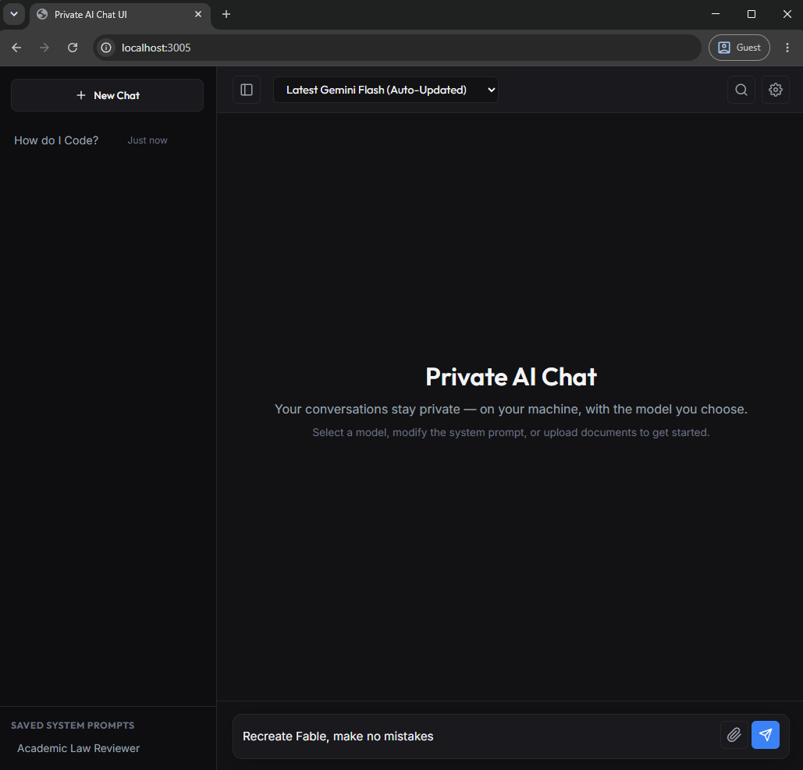

# Private AI Chat UI

**Private AI Chat UI** is an open-source, self-hosted ChatGPT-style chat interface for **Google Gemini**, **Anthropic Claude**, and **local or hosted OpenAI-compatible models** — Ollama, LM Studio, Groq, OpenRouter, DeepSeek, Mistral, xAI, Perplexity, llama.cpp, and vLLM. Bring your own API key (BYOK) or run **fully offline** with a local model. Your conversation history stays on your machine — **no telemetry, no accounts, no vendor lock-in**.

Initially, I built this for personal use, to enhance my privacy protection when using LLMs. I think this repository might be useful to some of you, and could help you save some tokens and time as well without having to recreate a chatbot UI from scratch. 

It's deliberately **bare-bones**: a complete, ready-to-run **Next.js** streaming chat app (SSE, document upload, Markdown rendering, live model switching) with **no UI framework** and **no database required** — built to be forked, re-skinned, and made your own, instead of spending hours (and thousands of tokens) rebuilding one from scratch.



**Use this if you want to:**
- Run a **private, local AI chatbot** where your chats never touch a third-party server.
- Use **Gemini, Claude, and local models in one interface**, switching per conversation.
- Get a **self-hosted ChatGPT alternative** with no monthly subscription — pay per token, or free with local models.
- **Fork a clean starting point** for your own AI app, research tool, or internal chat UI.

---

## ⚖️ How It Compares

Different tools solve different problems. **LibreChat** and **Open WebUI** are full, feature-rich *platforms*. However, this repo is a minimal *scaffold you own the code of*. Pick based on your goal.

| | **Private AI Chat UI (this repo)** | **LibreChat** | **Open WebUI** | **NextChat** |
| :--- | :--- | :--- | :--- | :--- |
| **Setup** | `npm run dev` — no Docker | Docker Compose | Docker / `pip` | `npm` / Vercel |
| **Database** | **None** — local JSON + Markdown files | MongoDB (required) | SQLite (Postgres optional) | **None** — browser localStorage |
| **Where chats live** | Server-side files on **your** machine | Server database | Server database | Client-side (browser) |
| **Stack** | Next.js + React | Node + React + Mongo | Python / FastAPI + SvelteKit | Next.js + React |
| **Providers** | Gemini · Claude · OpenAI-compatible · local | Many | Many | Many |
| **Design goal** | Minimal, hackable scaffold (~a dozen source files) | Full platform | Full platform | Lightweight client |

> **When to pick this repo:** you want to read the entire codebase in an afternoon and reshape it with minimal effort. If you need built-in RAG pipelines, user management, and a plugin ecosystem out of the box, LibreChat or Open WebUI will serve you better.

---

## 🎯 Purpose & Design Decisions

This repository is intentionally built as a **clean, unbloated starter foundation**. How you use, store, and style it is entirely up to you:

### 1. Save Tokens & Development Time
Building a full-stack streaming chat interface with Server-Sent Events (SSE), document parsing, markdown rendering, auto-scrolling, and model hot-swapping takes substantial time and token consumption if generated with AI coding assistants. This repo provides a robust, working starting point out of the box.

### 2. Flexible Storage: Local Files vs. Cloud Database
* **Default (100% Local File Storage):** Out of the box, all conversations, messages, saved system prompts, and auto-generated Markdown transcripts are stored in a local `./data/` folder as plain `.json` and `.md` files. There are **zero external databases** to configure, pay for, or maintain.
* **Built-in Supabase Toggle:** Want a shared/cloud database instead? Set `STORAGE_BACKEND=supabase` in `.env` (then `npm install @supabase/supabase-js` and run `supabase_schema.sql`). No code changes. The whole data layer sits behind a single façade ([`src/lib/db.js`](src/lib/db.js)), so adding another store (SQLite, Mongo, …) is one adapter file that mirrors [`src/lib/localDb.js`](src/lib/localDb.js).

### 3. Bare-Bones UI/UX — Ready for Your Custom Skin
* **Zero UI Bloat:** No massive design framework dependencies (no Tailwind, shadcn/ui, or heavy component libraries) that fight your overrides.
* **Instant Theming via CSS Variables:** All colors, backgrounds, borders, and typography are managed in a single file ([`src/app/globals.css`](src/app/globals.css)) using centralized `:root` CSS variables. You can change a few lines to completely transform the app's look and feel.
* **Blank Canvas:** Modify the layout, add custom sidebars, or embed the components directly into your own agent projects or internal team tools.

### 4. Privacy & Cost Efficiency
* **Zero Model Training:** By connecting via your own Google Cloud Vertex AI Express Mode API key or Gemini Developer key, your prompts and uploaded research papers are **excluded from foundation model training** under Google Cloud's commercial terms.
* **Pay-Per-Token vs. \$20/mo Subscriptions:** For academic drafting and personal research, pay-per-token API access typically costs only **\$0.50 to \$2.00 per month**, providing an immediate 90%+ cost saving compared to flat monthly web subscriptions.

> **Scope Note:** By default this talks to Google's Gemini API (Bring-Your-Own-Key) — private in the sense that your prompts aren't used for training, but requests still leave your machine for Google. For **fully local, offline inference**, set `LLM_BACKEND=openai` and point `OPENAI_BASE_URL` at a local runner like **Ollama** or **LM Studio** — then no data leaves your machine at all.

### 5. Run Any Model — Gemini, Anthropic, or any OpenAI-Compatible Provider
* **Three backends, one env switch:**
  - `LLM_BACKEND=gemini` (default) — Google Gemini via `@google/genai` SDK.
  - `LLM_BACKEND=anthropic` — Native Anthropic Claude via Messages API.
  - `LLM_BACKEND=openai` — Any OpenAI-compatible hosted provider or local runner.
* **Hosted provider presets (`OPENAI_PROVIDER`):** Just set `OPENAI_PROVIDER=groq`, `openrouter`, `deepseek`, `mistral`, `together`, `xai`, `perplexity`, `openai`, `ollama`, or `lmstudio` to auto-fill the base URL.
* **First-class local models:** Point `OPENAI_BASE_URL` at **Ollama** (`http://localhost:11434/v1`), **LM Studio**, **llama.cpp**, **vLLM**, **Jan**, or a hosted API. The model dropdown auto-populates from the running server's `/v1/models`.
* **One integration point:** All model I/O lives behind [`src/lib/llm.js`](src/lib/llm.js).

---

## ✨ Features

- ⚡ **Real-Time Streaming:** Smooth Server-Sent Events (SSE) token streaming.
- 🤖 **Multi-Provider & Multi-Model:** Google **Gemini**, Anthropic **Claude**, and any **OpenAI-compatible or local** model (Ollama, LM Studio, Groq, OpenRouter, DeepSeek, …). The model list **auto-discovers** what each backend offers, so it never goes stale.
- 📄 **Local Document Parsing:** Upload `.pdf`, `.txt`, `.md`, and `.csv` files; raw text is extracted locally and sent inline with conversation history.
- 🎓 **Google Scholar & Web Search:** Built-in search overlay and slash command autocomplete (`/search`, `/news`, `/scholar`) powered by Serper API.
- 📥 **One-Click Markdown Export:** Download complete formatted `.md` conversation transcripts with a single click.
- 📋 **Hover Copy Buttons:** Copy entire message bubbles or individual code blocks with instant visual feedback.
- ⚙️ **Prompt Engineering Studio:** Create, test, and save reusable system instruction presets.
- 📂 **Collapsible Sidebar:** Toggle the past conversations drawer to maximize chat reading space.

---

## 🚀 Quickstart

### Prerequisites:
- **Node.js** v18.17+ or v20+
- A Google Gemini API key from [Google AI Studio](https://aistudio.google.com/) or Google Cloud Vertex AI Express Mode.
- *(Optional)* A [Serper API](https://serper.dev/) key for live web and Google Scholar search.

### 1. Clone & Install
```bash
git clone <repo-url>
cd <repo-folder>
npm install
```

### 2. Configure Environment
```bash
cp .env.example .env
```
Open `.env` and paste your API keys:
```env
GOOGLE_VERTEX_API_KEY=your_gemini_or_vertex_api_key
SERPER_API_KEY=your_serper_api_key_optional
```

### 3. Run Locally
```bash
npm run dev
```
Open **`http://localhost:3005`** in your browser. All conversations will be saved locally in the `./data/` folder.

### (Optional) Switch backends
- **Local LLM:** in `.env` set `LLM_BACKEND=openai` and `OPENAI_BASE_URL` (e.g. `http://localhost:11434/v1` for Ollama). Pull a model first, e.g. `ollama pull llama3.1`.
- **Supabase storage:** `npm install @supabase/supabase-js`, run `supabase_schema.sql` in your project's SQL editor, then set `STORAGE_BACKEND=supabase` with `SUPABASE_URL` and `SUPABASE_SERVICE_KEY`.

See [`.env.example`](.env.example) for every option, and **[WALKTHROUGH.md](WALKTHROUGH.md)** for a step-by-step guide to choosing and configuring backends.

---

## ❓ FAQ

**Is this a self-hosted ChatGPT alternative?**
Yes. It's an open-source chat UI you run yourself. You bring your own API key (Gemini, Claude, OpenAI, Groq, DeepSeek, OpenRouter, …) or point it at a local model — so there's no subscription and no third-party service storing your chats.

**Can I run it fully offline / locally?**
Yes. Set `LLM_BACKEND=openai` and point `OPENAI_BASE_URL` at a local runner like **Ollama** or **LM Studio**. With a local model and local file storage, nothing leaves your machine.

**Can I use Gemini, Claude, and local models in the same app?**
Yes — switch backends with one env var (`LLM_BACKEND=gemini | anthropic | openai`). The OpenAI backend also covers hosted providers (Groq, OpenRouter, DeepSeek, Mistral, xAI, Perplexity, Together) via an `OPENAI_PROVIDER` preset.

**Do I need a database?**
No. By default, conversations, messages, prompts, and Markdown transcripts are stored as plain files in `./data/`. A one-line `STORAGE_BACKEND=supabase` toggle switches to Supabase Postgres if you want shared/cloud storage.

**Is my data private? Do you collect telemetry?**
Zero telemetry, no analytics, no accounts. On a local model, no data leaves your machine at all. On Gemini/Claude/hosted backends, your prompts go only to that provider using your own key — never to any server run by this project.

**How is it different from LibreChat or Open WebUI?**
It's intentionally minimal — no Docker, no database, no UI framework — so you can read the whole codebase and customize it quickly. See the **How It Compares** table above.

**What does it cost to run?**
The app is free (MIT). With local models it's free to run; with a hosted API you pay only per token — typically a few dollars a month for personal use, versus a flat monthly subscription.

**Which models are supported?**
Any Gemini model, any Claude model (via the Messages API), and any model exposed by an OpenAI-compatible endpoint — hosted or local. The model dropdown **auto-discovers** what's available, so it stays current as providers ship new models.

---

## 📁 Repository Structure

```
.
├── data/                         # Local storage (conversations, messages, prompts, exports)
├── src/
│   ├── app/
│   │   ├── api/                  # Modular Next.js route handlers
│   │   ├── globals.css           # Centralized CSS variables & theme styles
│   │   └── page.js               # Application entry point
│   ├── components/               # Bare-bones, hackable React components
│   └── lib/
│       ├── llm.js                # LLM backend dispatcher (gemini | openai | anthropic)
│       ├── genai.js              # Google Gemini backend
│       ├── anthropic.js          # Anthropic Claude Messages API backend
│       ├── openai.js             # OpenAI-compatible / local-LLM backend
│       ├── providers.js          # OpenAI provider presets (Groq, OpenRouter, DeepSeek, ...)
│       ├── db.js                 # Storage dispatcher (local | supabase)
│       ├── localDb.js            # File-based local storage engine
│       └── supabaseDb.js         # Supabase Postgres storage adapter
├── supabase_schema.sql           # Tables for STORAGE_BACKEND=supabase
├── AGENTS.md                     # Deep technical architecture & privacy spec
└── README.md
```

For complete technical specifications, API maps, and internal function references, see [**AGENTS.md**](AGENTS.md).

---

## 📜 License

Distributed under the **MIT License**. See [`LICENSE`](LICENSE) for more information.
